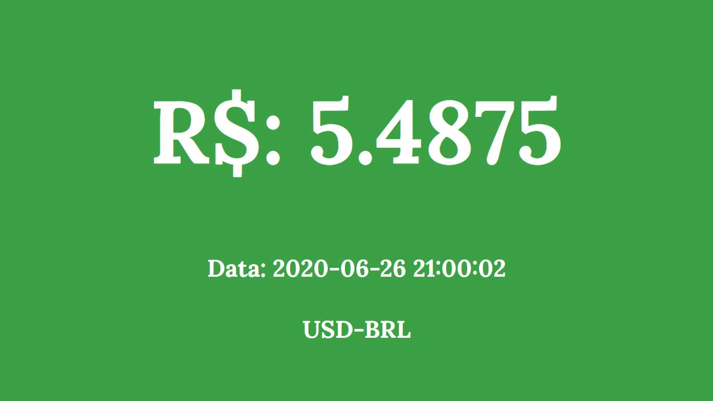

# Cotação do Dolar para Real através de API

## Utilizando APIs 
Com a finalização da primeira semana de aprendizados, eu como um iniciante da programação, visei hoje às Application Programming Interface(API). Iniciei o projeto logo pensando em algumas APIs públicas, como a [Olinda](https://olinda.bcb.gov.br/olinda/servico/PTAX/versao/v1/aplicacao#!/recursos), que é uma API do Banco Central, mas a implementação era realmente completa acabando sendo até mais do que precisava, então achei a API de contações da [AwesomeAPI](https://docs.awesomeapi.com.br/api-de-moedas), que realmente cumpriu o seu trabalho. Utilizando a fetch(), sem precisar fazer o download de nenhum pacote externo, criei logo no início do script a função colocando a url, depois com argumentos .then, chamando assim todos os dados necessários  . Procurei também trabalhar com a parte responsivo do site, pois todos os outros projetos da semana apresentava algumas falhas.
### Git Page https://tiago-xavier-braga.github.io/Dolar-em-real-6/
